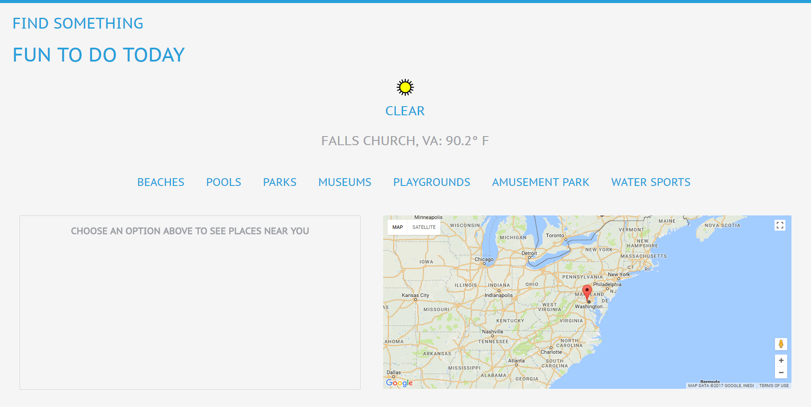
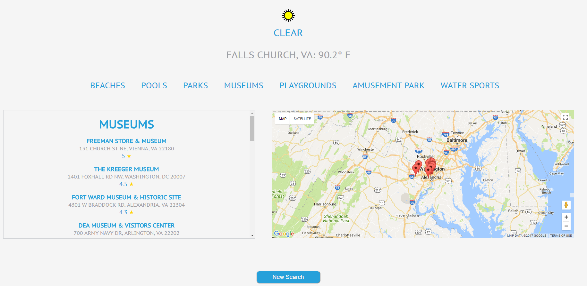

FindSomethingToDO 1st Capstone Project Thinkful.

Summary of App:

This app is used to help people find something to do depending on the the weather in the zip code that is provided. If the temparture is more cooler it gives ideas of things to do indoors. If it is hot there are more outdoor things to do. 

Technology Used: 
- HTML
- CSS
- JavaScript
- jQuery

  
  
  

